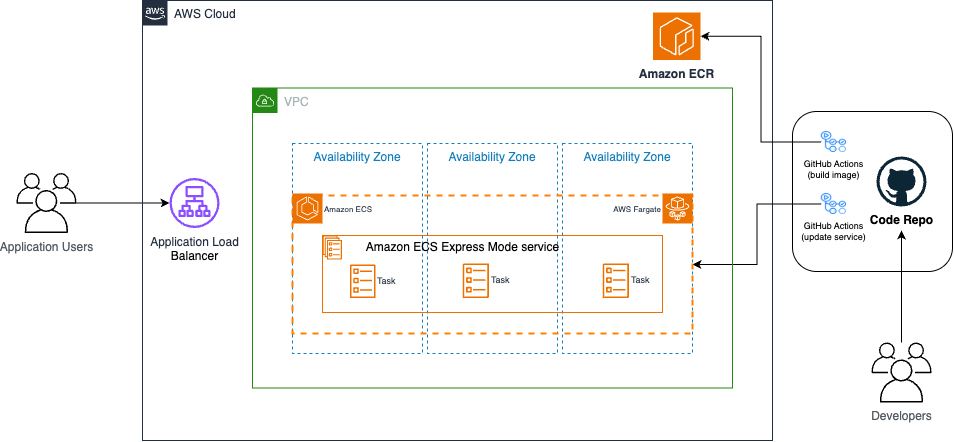

# Retail Store UI Application Deployment to Amazon ECS Express Mode 

This project demonstrates deploying the famous Retail Store UI Application to Amazon ECS Express Mode with automated deployment pipeline using GitHub Actions.

## Architecture Overview



## Project Structure

## Features

- **Containerized Deployment**: Docker-based deployment with Nginx
- **CI/CD Pipeline**: Automated build and deployment using GitHub Actions
- **ECS Integration**: Seamless deployment to Amazon ECS Express Mode
- **Health Monitoring**: Built-in health check endpoint

## Quick Start

### Prerequisites
- AWS CLI configured with appropriate permissions
- Docker installed locally

### Docker Deployment

```bash
# Build Docker image
docker build -t retail-store-sample-ui .

# Run container locally
docker run -p 8080:8080 retail-store-sample-ui
```

### Create Amazon ECR repo `retail-store-sample-ui`

```bash
aws ecr create-repository \
  --repository-name retail-store-sample-ui \
  --image-tag-mutability IMMUTABLE \
  --image-scanning-configuration scanOnPush=true 
```

### Create required IAM Roles for express mode

Refer to steps in [Create IAM roles](https://docs.aws.amazon.com/AmazonECS/latest/developerguide/express-service-getting-started.html#express-service-create-execution-role)

### Create Express Mode service

With the basic GitHub Actions workflow in `.github/workflows` you can establish an automated pipeline that builds your application, packages it into a container image, and deploys it to ECS Express Mode.

```bash
- name: Deploy to ECS Express Mode
  uses: aws-actions/amazon-ecs-deploy-express-service@v1
  with:
    service-name: my-service
    image: 123456789012.dkr.ecr.us-east-1.amazonaws.com/my-app:latest
    execution-role-arn: arn:aws:iam::123456789012:role/ecsTaskExecutionRole
    infrastructure-role-arn: arn:aws:iam::123456789012:role/ecsInfrastructureRole
```

## Learn More

- [Amazon ECS Documentation](https://docs.aws.amazon.com/ecs/)
